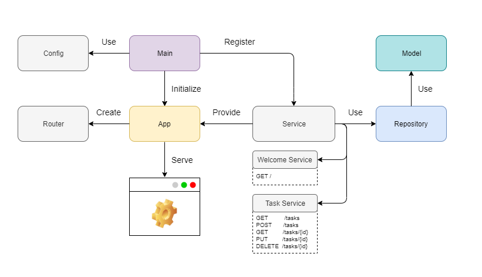

# Todo API with Golang

This repo includes a restful api example for simple todo application with Golang(go1.14).

### Architecture



### Installation

1. Download this project with ```go get```.

```bash
$ go get github.com/hakanyolat/go-todo-api
```

2. Install the dependencies with ```go mod```.

```bash
$ go mod vendor
```

### Configuration

Configurations are defined in the ```.env``` file(s).

```
SERVER_HOST=127.0.0.1
SERVER_PORT=3000

DATABASE_DIALECT=mysql
DATABASE_HOST=127.0.0.1
DATABASE_PORT=3306
DATABASE_USERNAME=admin
DATABASE_PASSWORD=admin
DATABASE_NAME=todoapi
DATABASE_CHARSET=utf8
```

Instead of using the default ```.env``` file, you can run the application with the ```-env``` flag to use the ```env``` 
file of the environment you specify. You can ask for help to see the possible env values.

```bash
$ go run main.go -h

  -env string
        The environment option for application. Possible values: local, dev, test, mock.
```

Alternatively, you can set the environment value as in the example below.

```bash
$ export SERVER_HOST=localhost
$ export SERVER_PORT=8080
```

> Note: Make sure [GOPATH](https://github.com/golang/go/wiki/GOPATH) is present in your Environment values.

### Run

```bash
$ go run main.go
```

### Tests
You can use the command below to run the tests.

```bash
$ go test ./test -v
```

### Endpoints

Since this is a simple example, it consists of only a few endpoints.

| METHOD       | PATH         | DESCRIPTION |
| ------------ | ------------ | ------------ |
| GET          | /            | Homepage
| GET          | /tasks       | Get all tasks |
| POST         | /tasks       | Create new task. |
| GET          | /tasks/{id}  | Get task by ```{id}```|
| PUT          | /tasks/{id}  | Update task by ```{id}```|
| DELETE       | /tasks/{id}  | Delete task by ```{id}```|

There is also a postman collection(```Go Todo API.postman_collection.json```) in the repo so you can test it via Postman.